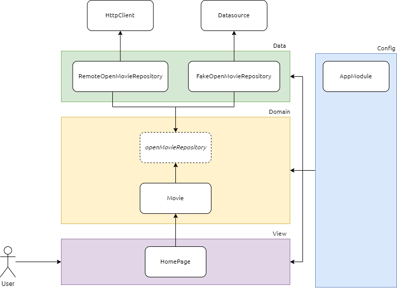

<p align=center>
  <a href="#sobre" style="font-weight: 500; font-size: 1.25rem;">Sobre</a> • 
  <a href="#tecnologias" style="font-weight: 500; font-size: 1.25rem;">Tecnologias</a> • 
  <a href="#instalacao" style="font-weight: 500; font-size: 1.25rem;">Instalação</a> • 
  <a href="#autores" style="font-weight: 500; font-size: 1.25rem;">Autores</a> 
</p>
<br>

# Sobre

Trabalho Prático da disciplina de Modelagem e Implementação de Software da Universidade Federal de Lavras (UFLA), lecionada pelo professor Paulo Júnior.

O objetivo deste trabalho é colocar em prática os conceitos aprendidos ao longo da disciplina. Dentre os temas, escolhemos:

- D) Desenvolver outro tipo de aplicação, utilizando Angular/Ionic ou outra tecnologia/framework.
  Atenção: qualquer que seja a aplicação escolhida, esta deve acessar remotamente algum tipo de serviço externo (API).

Dessa forma, criamos o **MIS MAX** que é inspirado no HBO MAX, a aplicação nos permite realizar buscas por filmes, nos retornando o título, sinopse e seu poster. A tecnologia escolhida foi o **React** e utilizamos a **API OMDb**.

## API

A **OMDb API** é uma API pública e gratuita que fornece acesso a informações sobre filmes e séries, tais como título, ano de lançamento, gênero, sinopse, cartaz, elenco, entre outras informações.

- [OMDb API](https://www.omdbapi.com/)

## Arquitetura de Camadas

O MIS MAX foi projetado e implementado de acordo com a arquitetura de camadas View, Domain e Data.

- **View** é responsável pela interface do usuário e pela interação com o usuário.
- **Domain** é responsável por definir as regras de negócio e a lógica do sistema.
- **Data** é responsável por forncer os dados para a camada Domain.



# Tecnologias


# Instalacao

Para preparar o ambiente para utilização da aplicação _MISMAX_:

- Instale o [Node.js](https://nodejs.org/en/), preferencialmente a versão LTS, em seu computador.

Uma vez preparado o ambiente, clone este repositório e abra a pasta do projeto em sua IDE favorita.

```
git clone https://github.com/larisnarciso/GCC132-MIS-MAX.git
```

Execute o comando abaixo para instalar as dependências do projeto:

```
npm install
```

Para criar sua propria chave de API, acesse o site https://www.omdbapi.com/, faça seu cadastro.

Busque pelo arquivo chamado `api-config.ts` no diretório `src` do projeto, contendo o conteúdo abaixo (altere a propriedade `key` para a sua chave de API):

```ts
export const openVideoConfig = {
  key: '<sua-chave-de-api>',
  URL: 'https://www.omdbapi.com/',
};
```

**Obs: Para executar a aplicação sem a utilização de uma API externa, busque pelo arquivo chamado `App.tsx` e comente a linha referente a API externa e descomente a linha de código referente ao repositorio fake.**

Para executar a aplicação, digite o comando abaixo no terminal:

```
npm start
```

# Autores

<table style="width: 100%;">
  <tr>
    <td style="padding: 16px;">
      
    </td>
    <td style="padding: 16px;">
      
    </td>
    <td style="padding: 16px;">
      
    </td>
    <td style="padding: 16px;">
      
    </td>
  </tr>
  <tr>
    <td style="text-align: center;">Arlan Trindade</td>
    <td style="text-align: center;">Anna Flávia Lopes</td>
    <td style="text-align: center;">Larissa Narciso</td>
    <td style="text-align: center;">Olivia Campos</td>
  </tr>
</table>
